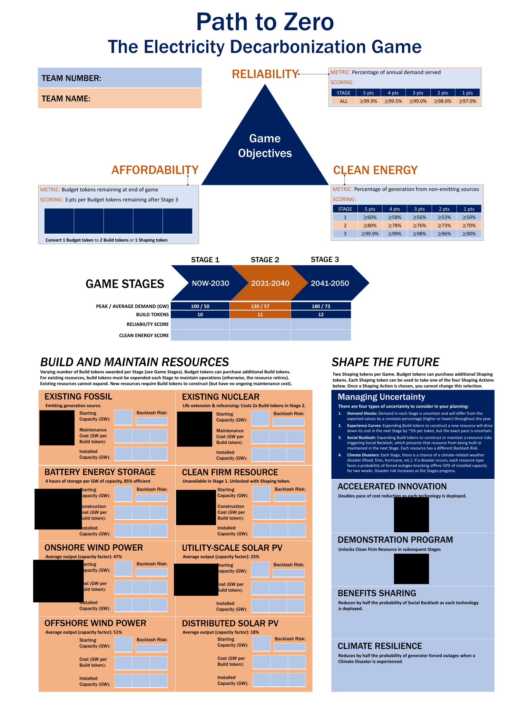

[](https://github.com/PrincetonZEROLab/Path-to-Zero/actions/workflows/documentation.yml)
[](https://princetonzerolab.github.io/Path-to-Zero/dev/)

# Path To Zero
## The Electricity Decarbonization Game

Path To Zero is a **multi-stage planning under deep uncertainy strategy game** designed to help players understand the challenges of decarbonizing the electricity sector. The objective of the game is to develop a portfolio of resources that can meet the demand at the lowest cost while also achieving stringent environmental goals. 

The game simulates electricity system operations, allowing players to test out their strategies, build intuition about how power systems operate, and develop a plan to create a portfolio of resources that meets both their reliability and clean energy goals, which are two of the three objectives for which they are scored in the game.

## How to Play
For detailed game instructions, please refer to the [game play instructions](https://princetonzerolab.github.io/Path-to-Zero/dev/instructions/) and [getting started](https://princetonzerolab.github.io/Path-to-Zero/dev/getting_started/) sections of the manual.

## How to Run Path To Zero on GitHub Codespaces (GitHub account required)
1. Navigate to the following [GitHub page](https://github.com/PrincetonZEROLab/Path-to-Zero) and click the "Code" button.
2. Click the "Codespaces" tab.
3. Click the "Create codespace on main" button.
4. Once the codespace is created, you can start the game by running the following command in the command line:
```bash
bash run_game.sh
```
or
```bash
make start_game
```
5. Navigate to `localhost:8000` in your web browser to access the game, or use ctrl+click (cmd+click on Mac) on the URL that appears in the terminal.

**Note**: All personal GitHub accounts are limited to 120 hours of compute time and 15GB of storage per month. You can learn more about the limitations [here](https://docs.github.com/en/billing/managing-billing-for-github-codespaces/about-billing-for-github-codespaces) and [here](https://docs.github.com/en/codespaces/overview).

## How to Install Path To Zero (local installation)
1. **Install Julia**: We recommend following the [Julia installation guide](https://julialang.org/downloads/).

2. **Clone the repository**: You can clone the repository by typing the following command in your command line:
```julia
git clone https://github.com/PrincetonZEROLab/Path-to-Zero.git
cd Path-to-Zero
```
or, if you do not have git installed, you can download the repository as a zip file by clicking the "Code" button on the GitHub page and then clicking the "Download ZIP" button.

3. **Install the game**: To install the game, type the following command in your command line:
```julia
julia -e 'import Pkg; Pkg.activate("."); Pkg.instantiate()'
```

4. **Run the game**: To run the game, use the following commands:
On **Linux/MacOS**:
```bash
bash run_game.sh
```
On **Windows**:
```julia
julia --project -q -i -e "using Pkg; Pkg.precompile(); using GenieFramework; Genie.loadapp(); up();" 
```

5. **Launch the game**: Open your web browser and go to `http://localhost:8000/` to access the game.

## The Team
The game was created and designed by [Jesse D. Jenkins](https://mae.princeton.edu/people/faculty/jenkins) and developed by the [Princeton ZERO Lab](https://mae.princeton.edu/people/faculty/jenkins) and the [Princeton RSE Group](https://researchcomputing.princeton.edu/services/research-software-engineering) at Princeton University.

## Troubleshooting
If you encounter any issues, please open an issue on the [GitHub page](https://github.com/PrincetonZEROLab/Path-to-Zero/issues) or contact Luca Bonaldo (lucabonaldo@princeton.edu).

